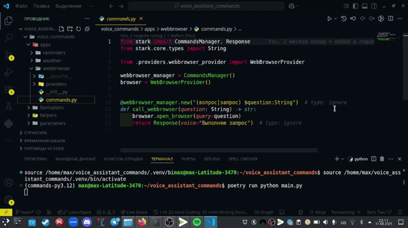

# Voice assistant A.R.C.I.
## Brief overview
I did an internship at an American company. And I was given the task 
> *Develop a **voice assistant** for a smart speaker* 

the company specializes in smart homes
___


## Resources
For development, the company's internal development was used - the [**STARK**](https://stark.markparker.me/) framework

Regarding other libraries
+ iCalendar (Working with the calendar)
+ MPRIS (Media Player Remote Interfacing Specification)
+ D-bus (communication between processes)
The rest can be seen in pyproject.toml
___
## Structure
The project consists of the following applications

+ :file_folder:app
  + :watch:clock
    + :file_folder:current_time
    + :file_folder:stopwatch
    + :file_folder:timer
  + :radio: mediaplayer
  + :calendar: reminder
  + :mount_fuji: weather
  + :mag_right: webbrowser
+ :file_folder: helpers
+ :file_folder: parameters
+ :file_folder: providers


I would like to briefly walk through the application, show the code and how it works
___

## Clock
#### Current time
Each application has a file with the name of the ***provider*** (this provider passes data to our assistant's response itself)

```python
from datetime import datetime

# from stark import Response # not allowed in providers
import pytz
from timezonefinder import TimezoneFinder

from voice_commands.providers.location_provider import Coordinates


class TimeProvider:
    def get_time(self, location: Coordinates | None = None) -> datetime:
        if not location:
            return datetime.now()

        timezone_str = TimezoneFinder().timezone_at(lat=location.latitude, lng=location.longitude)

        if not timezone_str:
            raise ValueError("Could not determine timezone for the given location.")

        local_time = datetime.now(pytz.timezone(timezone_str))

        return local_time
```
First we check the **location** parameter to see if it exists. If there is no parameter, then return the current time. If the condition does not work, then we transfer the location coordinates to TimeZoneFinder. If the time zone is not found, raise an error. If the condition did not work - set the time zone using pytz and return the time

commands are registered as follows
```python
@time_manager.new("время( $city:String)?")
async def call_time(city: String | None = None):
    if city is not None:
        city_name = str(city.value).title()
    else:
        city_name = None

    coordinates = await LocationProvider().get_coordinates(city_name)
    time = TimeProvider().get_time(coordinates)
    formatted_time = TimeFormatter(time).get_formatted_time()
    hour, minute = num2word(formatted_time[0]), num2word(formatted_time[1])

    if city is not None:
        sentence = f"В {city_name} сейчас {hour} часов {minute} минут"
    else:
        sentence = f"Сейчас {hour} часов {minute} минут"

    return Response(voice=sentence)


@time_manager.new("дата")
def call_date():
    now = TimeProvider().get_time()
    sentence = TimeFormatter(now).get_formatted_date()
    print(sentence)
    return Response(voice=sentence)

```
___

#### Stopwatch

Now the implementation is a little simpler

```python
import time


class StopwatchProvider:
    
    def __init__(self) -> None:
        self.start_time = None

    def start(self):
        self.start_time = time.time()

    def elapsed(self):
        if self.start_time is None:
            raise RuntimeError("Stopwatch has not been started.")
        return time.time() - self.start_time

    def reset(self):
        self.start_time = None

```

Commnads registration
```python
from stark import CommandsManager, Response

from .providers.stopwatch_provider import StopwatchProvider

stopwatch_manager = CommandsManager()
stopwatch = StopwatchProvider()


@stopwatch_manager.new("проверь секундомер")
def elapsed():
    if stopwatch.start_time is None:
        return Response(voice="Секундомер не запущен")
    
    print(f"Прошло: {stopwatch.elapsed()} секунд")  # TODO: convert to time interval and format it nicely
    

@stopwatch_manager.new("секундомер")
def start():
    stopwatch.start()
    return Response(voice="Секундомер запущен")


@stopwatch_manager.new("(сброс|сбросить)")
def stop():
    if stopwatch.start_time is None:
        return Response(voice="Секундомер не запущен")

    print(f"Секундомер остановлен: {stopwatch.elapsed()} с") 
    stopwatch.reset()
```
___

#### Timer

I want to go into more detail here
. There are entities that exist in a single copy.
Let's get down to business. It is logical that there can be a large number of timers. For this, we create models.

```python
from dataclasses import dataclass
from datetime import datetime


@dataclass
class TimerModel:
    target_time: datetime

    def return_seconds(self) -> int:
        delta = self.target_time - datetime.now()
        return int(delta.total_seconds())
```

I also want to talk about an important thing within STARK. The framework has the concept of a **user class**. These are parsers built into command templates. 
They can take either one word or the entire line to the end, and then parse it. For example, the user sets the command
> ***set the timer for five minutes*** 

(STARK does not recognize numbers). And we need to somehow get these 5 minutes. So that then, so to speak, put the process to sleep, and after it is completed, return a message
```python
from datetime import datetime

import dateparser
from stark.core.patterns import Pattern
from stark.core.types import Object, ParseError
from stark.general.classproperty import classproperty


class Interval(Object):
    value: datetime | None

    @classproperty
    def pattern(cls) -> Pattern:
        return Pattern("**")

    async def did_parse(self, from_string: str) -> str:
        parsing = dateparser.parse(from_string)
        current_date = datetime.now()
        if parsing is None:
            raise ParseError("Failed to parse interval")
        

        if parsing <= current_date:
            self.value = current_date + (current_date - parsing)
            return from_string

        raise ParseError("the time indicated is past")


Pattern.add_parameter_type(Interval)
```

let's go back to the provider
```python
class TimerProvider:
    def __init__(self):
        self.list_timers = []

    def set_a_timer(self, interval: Interval) -> int | Response:
        if interval.value is not None:
            end_time = interval.value
            if end_time < datetime.now():
                return Response(voice="Указанное время уже прошло, пожалуйста, установите другое время.")

        seconds = TimerModel(end_time).return_seconds()  # type: ignore
        self.list_timers.append(self)
        return seconds

    def get_a_list_of_timers(self) -> list | str:
        if self.list_timers:
            active_timers = [f"Таймер {num2word(index + 1)}" for index in range(len(self.list_timers))]
            return active_timers
        else:
            return "Нет активных таймеров."

    def check_timer_status(self) -> str:
        count = len(self.list_timers)
        if count:
            return f"Количество активных таймеров: {num2word(count)}"
        else:
            return "Нет активных таймеров."

    def cancel_timer(self):
        if not self.list_timers:
            return Response(voice="Нет таймеров для отмены.")

        self.list_timers.pop(0)
```
Let's go through the provider. Our provider stores timers (models). 
And methods: 
1. set timer
2. get list of timers
3. check timer status
4. delete timer

Commands
```python
import asyncio

from stark import CommandsManager, Response

from voice_commands.apps.clock.timer.parameters.interval import Interval
from voice_commands.apps.clock.timer.providers.provider_timer import TimerProvider

timer = TimerProvider()
timer_manager = CommandsManager()


@timer_manager.new(
    "(поставь|установи|запусти|заведи|включи|сделай|стартуй) (таймер|счётчик) (на|через) $interval:Interval"
) # type: ignore
async def call_timer(interval: Interval):
    response = timer.set_a_timer(interval)
    if isinstance(response, Response):
        # Если вернулся Response (ошибка), озвучиваем его
        yield response
    else:
        yield Response(voice="Таймер установлен")
        # Если вернулось число (секунды), ждём и уведомляем
        await asyncio.sleep(response)
        yield Response(voice="Таймер сработал!")


@timer_manager.new("покажи таймер")
def call_show_the_timer():
    response = timer.get_a_list_of_timers()
    if isinstance(response, list):
        return Response(voice=f"Активные таймеры: {', '.join(response)}")
    else:
        return Response(voice=response)


@timer_manager.new("проверить состояние таймера")
def call_check_state_timer():
    response = timer.check_timer_status()
    return Response(voice=response)


@timer_manager.new("(отмени|удали) (таймер|счётчик)")
def call_cancel_timer():
    response = timer.cancel_timer()
    if isinstance(response, Response):
        return response
    else:
        return Response(voice="Таймер отменён.")

```


This is a short short story about one application. You can see the rest for yourself.
___

#### example of work
I want to demonstrate the operation of several applications, which could be seen clearly.
An example would be opening links in the browser and media player
