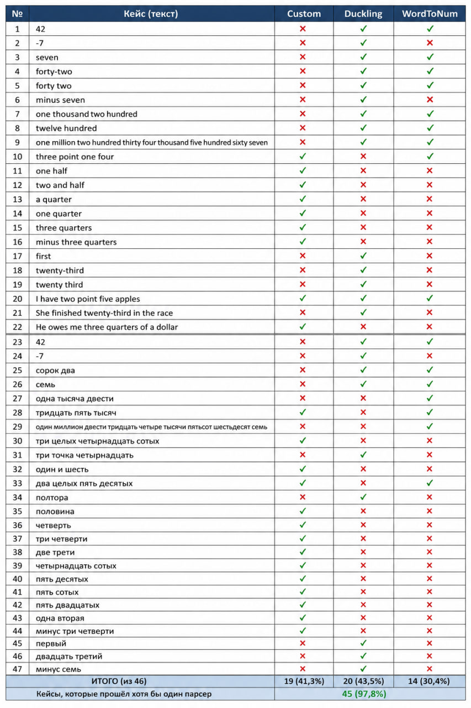

# Hybrid Method

For NLNumber, a hybrid method is used - combining all implementations into one class based on ***language features***

```python
class NLNumberDelegate:

    def __init__(self) -> None:
        self.language_parsers: dict[str, Tuple[NLNumberParseCustom, NLNumberParserDucklingTranslated, NLNumberParseWordToNum]] = {
            "ru": (
                NLNumberParseCustomRu(), 
                NLNumberParserDucklingTranslatedRu(),
                NLNumberParseWordToNumRu(),
            ),
            "en": (
                NLNumberParseCustomEn(),
                NLNumberParserDucklingTranslatedEn(),
                NLNumberParseWordToNumEn(),
            )
        }
```

This decision was made because each implementation separately does not cover all cases.




Also, one important note: NLNumber works with duckling, which needs to be installed. It works via Docker.

```bash
sudo rm -rf ~/snap/code/*/.local/share/containers
sudo rm -rf ~/snap/code/current/.local/share/containers


podman run -d \
  --name duckling \
  -p 127.0.0.1:8000:8000 \
  docker.io/rasa/duckling

podman start duckling
```